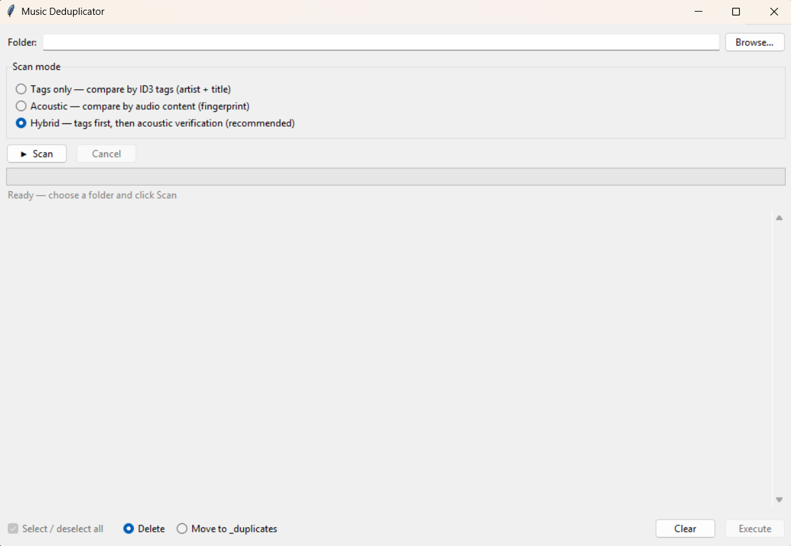

# Music Deduplicator

> **Создано с помощью AI** — весь код написан через [OpenCode](https://github.com/anomalyco/opencode) (DeepSeek).

GUI-приложение для поиска и удаления дубликатов MP3-файлов. Находит одинаковые песни и оставляет версию с лучшим качеством (наивысшим битрейтом).

## Возможности

- **3 режима поиска дубликатов:**
  - **Tags only** — сравнение по ID3-тегам (исполнитель + название)
  - **Acoustic** — сравнение по аудио-содержанию (акустический фингерпринт)
  - **Hybrid** — теги + акустическая проверка (рекомендуется)
- Оставляет файл с наивысшим битрейтом, остальные помечает как дубликаты
- Удаление или перемещение дубликатов в папку `_duplicates`
- Кеширование акустических отпечатков для быстрого повторного сканирования
- Работает без ffmpeg (использует Windows Media Foundation через miniaudio)

## Скриншот



## Скачать

Скачай готовый `.exe` — не нужен Python:  
[find_duplicates.exe](https://github.com/velosipedf-cell/music-deduplicator/releases/latest)

## Установка (из исходников)

```bash
git clone https://github.com/velosipedf-cell/music-deduplicator.git
cd music-deduplicator
pip install -r requirements.txt
```

## Запуск

```bash
python music_dedup.py
```

Также есть консольная версия:

```bash
# Сухой прогон (только показать дубликаты):
python find_duplicates.py "D:\Music" -n

# Удалить дубликаты:
python find_duplicates.py "D:\Music"

# Переместить в _duplicates:
python find_duplicates.py "D:\Music" -m
```

## Как работает акустический режим

1. Декодирует MP3 в PCM через Windows Media Foundation (ffmpeg не требуется)
2. Берёт отрезок с 10-й по 90-ю секунду (пропускает тишину в начале)
3. Строит mel-спектрограмму (32 полосы, 200 Гц – 11 кГц)
4. Вычисляет бинарный отпечаток: разница энергии между соседними кадрами
5. Сравнивает отпечатки по расстоянию Хэмминга (порог сходства: 80%)
6. Фингерпринты кешируются в `%TEMP%\music_dedup_cache\`

## Зависимости

- **mutagen** — чтение ID3-тегов и битрейта MP3
- **numpy + scipy** — обработка сигналов, спектрограмма
- **miniaudio** — декодирование аудио (Windows Media Foundation)
- **tkinter** — GUI (входит в стандартную поставку Python)
